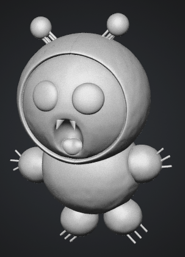

# 🐾 Mocapy - Original Character Project

3Dプリンターでのビジネス展開を目指す、オリジナルキャラクター「Mocapy（モカピー）」の公式開発リポジトリです。
キャラクターイラストの管理から、3Dモデリング、試作・商品化までのすべてのプロセスをここで記録・管理します。

---

## 🌟 Mocapy（モカピー）とは？
コーヒーの湯気から生まれた、カフェやデスクに出現する小さな温かい妖精です。
デスクワークで疲れた人のそばにそっと寄り添い、日常に小さな癒やしを届けます。

* **コンセプト**: ガジェット好き・デスクワーカーの日常を癒やす、コーヒー色のゆるキャラ
* **ターゲット層**: 20〜30代のインテリア好き、リモートワーカー、カフェ文化が好きな人々

### 📝 キャラクタープロフィール
* **名前**: Mocapy（モカピー）
* **種族**: カフェの妖精
* **見た目の特徴**: 
  * ほんのりコーヒー色（モカ色）の、丸みのあるもちもちした体
  * 頭には、コーヒーの湯気（またはホイップクリーム）のような丸いかざりがある
  * 手にはいつも、お気に入りの小さなコーヒー豆（またはマグカップ）を持っている
* **性格**: マイペースでのんびり屋。ほのかなコーヒーの香りがするとどこからともなく現れる。
* **好きな場所**: パソコンのキーボードの横、マグカップのふち、温かいカフェの片隅。
* **手足の鋭そうな爪（攻撃力ゼロ）**: 
  * 一見すると鋭そうに見えますが、実際は毛糸並みに柔らかい質感です。そのため攻撃力はゼロに等しく、触れても全く痛くありません。
* **口に生えている小さな牙（かゆみ成分の謎）**: 
  * 口元からのぞく牙は、噛まれるとチクッとします。しかしモカピーは顎の力が非常に弱く、大好物のドーナツすら噛みちぎるのに一苦労するほどの非力です。
* **噛まれたときのかゆみと、口を開けている理由**: 
  * 牙で噛まれると蚊のような「かゆみ成分」が放出され、ほのかな痒みに襲われます。この成分は分解されやすく、痒みは2分程度しか持続しません。また、モカピー自身もこの成分への抗体を持っておらず、自分の口の中を頻繁に痒がっています。普段よく口を開けているのは、その痒みを空気で和らげるためだと言われています。

---

### 🎨 カラーバリエーション（通常種と亜種）

モカピーはモカ色（コーヒー色）の通常種だけだと思われていましたが、最近になってカフェの様々なメニューから生まれたと思われる個性豊かな亜種たちが確認されています。

#### ☕️ Mocapy（通常種）
* **モチーフ**: レギュラーコーヒー / モカ
* **見た目の特徴**: ほんのりコーヒー色（モカ色）の、丸みのあるもちもちした体。
* **チャームポイント**: 頭にはコーヒーの湯気のような丸いかざりがあり、手にはいつもお気に入りの小さなコーヒー豆（またはマグカップ）を持っている。

#### 🌸 Mocapy Sakura-Whip（モカピー・サクラホイップ）
* **モチーフ**: サクララテ
* **見た目の特徴**: ふんわりとした優しい薄いピンク色の体。
* **チャームポイント**: 頭のかざりが、まるで絞りたてのホイップクリームのように見えるのが特徴。
* **固有の生態**: 春のあたたかい日差しが差し込む窓際の席によく出現する。ほんのり甘い香りが漂い、見ているだけで心が穏やかになる。

#### 🐈‍⬛ Mocapy Black（モカピー・ブラック）
* **モチーフ**: エスプレッソ / ブラックコーヒー
* **見た目の特徴**: 深煎りコーヒーを思わせる、ツヤのある黒い体。他のモカピーに比べて少しシュッとした佇まいに見える。
* **固有の生態**: 深夜のデスクワークや、集中して作業をしている人のキーボードの横に現れやすい。一見クールだが、他の種と同じく非力で、大好物のチョコオールドファッションドーナツに苦戦している姿が目撃されている。

#### 🍋 Mocapy Yuzu-Lemon（モカピー・ユズレモン）
* **モチーフ**: ゆずシトラスティー / エスプレッソレモネード
* **見た目の特徴**: 爽やかなドリンクを思わせる、鮮やかなレモンイエローの体。
* **チャームポイント**: 柑橘系の酸味のある爽やかな香りが特徴。
* **固有の生態**: 少しでも気分をリフレッシュさせたい人のデスクに出現し、ビタミンカラーの見た目で日常に元気を届けてくれる。

---



© 2026 Idelity
---

## 🎨 展開予定の商品アイデア（3Dプリントグッズ）
世界観を活かし、大量生産品にはない「実用性」と「癒やし」を兼ね備えたニッチな商品を展開します。

1. **マグカップ・キーパー（カップのフチ用フィギュア）**
   * マグカップのフチに引っかかるMocapy。ティーバッグの紐を固定できる実用的なフック付き。
2. **デスクの上の「スマホ ＆ ペンスタンド」**
   * Mocapyが後ろからスマホを支えてくれるデザイン。デスクの上をカフェ空間にするインテリア。
3. **おうちカフェ用「オリジナルクッキー型 ＆ スタンプ」**
   * 自宅でコーヒーを楽しむ人向け。食品衛生法適合PLAを使用し、Mocapy型のスイーツが作れる資材。

---

## 📂 ディレクトリ構成
本リポジトリは以下の構造でデータを管理します。

```text
Mocapy/
├── README.md        # プロジェクトの概要（本ファイル）
├── caｄ/.           # pythonスクリプト＆STL
└── designs/         # 原画、ラフイラスト（PNG/JPG）
```

---

## 🛠️ 使用ツール・動作環境
* **デザイン**: Mac標準アプリ（フリボード / プレビュー）
* **データ変換**: SVGベクター変換ツール
* **3D生成AIツール**:
  * **Meshy**: イラストから自動で3D試作モデルを生成
  * **Tripo3D**: テキストや画像から高品質な3Dデータを自動出力
* **3Dモデリング・調整**: Tinkercad / Blender
* **使用素材**: PLA（通常・食品衛生適合）、PETG

---

## 🚀 今後のロードマップ
- [ ] 1. キャラクターの基本デザイン決定（正面・横・後ろのラフ作成）
- [ ] 2. イラストのSVG（ベクター）化、または3D生成AIへの投入
- [ ] 3. 3Dモデルのクリンアップ・調整（Tinkercad等で印刷用底面の作成）
- [ ] 4. 試作プリントと素材（PLA/PETG等）の選定
- [ ] 5. フリマアプリ（メルカリ・minne等）でのテスト販売開始
