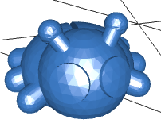
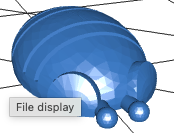
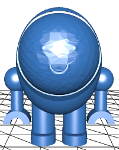

# モカピー・ワールド 公式サブキャラクター名鑑

この文書は、モカピーの冒険に登場する頼もしい仲間やサブキャラクターたちを記録する公式図鑑です。（新しいキャラクターが誕生するたびに、下に追加していきます）

---

## 🐞 Lad-B（レドビー）
**「その太い脚でどんな大地も踏みしめる、モカピーの頼れる巨大てんとう虫！」**

### 📝 基本ステータス
* **登録番号：** No.002
* **名前の由来：** てんとう虫（Ladybug）がベース。`Lad`（頑丈な男・タフな奴）＋ `BIG`（巨大なてんとう虫）の頭文字。3Dプリンター（Bambu Lab A1 mini）の名称も含まれる。
* **サイズ分類：** チビサイズ（実物のてんとう虫より一回り大きい）

### 🛠️ 特徴・ディテール
* **強靭な丸太足（むちむち脚部）**
  巨大な自重を支え、過酷な3Dプリントの試練（剥がれ）に耐えるために進化を遂げた、極太の足。
* **低重心フラット・ベリー（真っ平らなお腹）**
  サポート材（支柱）という甘えを一切排除し、自らの意思でベッドに100%ベタッと密着する、驚異のサポートレス構造。
* **バックフロー・アンテナ（後ろ流れの触角）**
  頭部から背中側へとしなやかに流れる美しいツノ。3Dプリンターが下からの積層だけで綺麗に造形できるよう計算されている。

### 📖 誕生エピソード
西暦2026年、3Dプリンター（Bambu Lab A1 mini）のファーストレイヤー上で14個中7個がぐちゃぐちゃになる試練が発生。一時は全滅の危機に瀕したが、設計者の手によって「1層目の速度を50から15に落とす」という究極の構造改革が行われ、1発で完璧に定着する最強のボディ「Lad-B」が覚醒した。

### 🤝 モカピーとの関係
いつも自由奔放に動き回るメインキャラ「モカピー」の頭や背中に捕まって周りの様子を観察している。モカピーの危険を瞬時に察知し、モカピーにそれを伝達する頼もしい相棒。

---

© 2026 Idelity

---

## 🍂 No.003：Dangoloron（ダンゴロロン）
**「モカピーの背中が特等席！どこへでも一緒についていく、小さなちいさな冒険家」**

### 📝 基本ステータス
* **登録番号：** No.003
* **名前：** ダンゴロロン（Dangoloron）
* **サイズ分類：** 極小（手のひらで転がるチビサイズ）
* **出現場所：** 公園のひだまり、落ち葉の下、カフェのテラス席

### 🛠️ 特徴・ディテール
* **セグメント・シェル（節のある背中）**
  何層にも重なった美しい甲羅。3Dプリンターの「積層」の力を利用して、サポートなしで最も滑らかに立体化できるよう設計された。
* **どっしりローリング・ベース（真っ平らな底面）**
  ダンゴムシ特有の「丸まるポーズ」をベースにしつつ、お腹を完全にベッドに密着させることで、印刷中の転がりや剥がれを完全に克服。

### ⚔️ 必殺技：ダンゴロロンアタック
* **威力：** ★☆☆☆☆（当たってもちょっとくすぐったい程度）
* **迫力：** ★★★★★（相手の度肝を抜く大迫力！）
* **効果：** 
  体を限界まで丸めて超高速回転し、大爆発のようなド派手な気迫と共に突っ込んでいく。ダメージはほぼ無いが、あまりの勢いの良さに敵は「うわっ！何事だ！？」と一瞬フリーズしてしまう。その隙にモカピーたちが次の行動に移れるという、トリッキーで頼もしい技。

### 🤝 他のキャラとの関係
公園でモカピーと出会って大親友になった。大好きな**モカピーの背中**の上に乗せてもらい、一緒にカフェや公園を冒険するのが日課。
通常のてんとう虫より一回りか二回り大きい相棒「No.002 Lad-B（レドビー）」のことも慕っており、モカピーの背中からレドビーへ「ダンゴロンアタック」のポーズを見せて、お互いの頑丈さを競い合ったりしている。

---

© 2026 Idelity

---

## ☕ No.004：Capuchi（カプッチ）
**「卵型ボディにだらりん両腕。ポツンと佇む、モカピー・ワールド一のマヌケな癒やし系」**

### 📝 基本ステータス
* **登録番号：** No.004
* **名前：** カプッチ（Capuchi）
* **サイズ分類：** 中型（通常種より一回り小さく、ポツンと立ち尽くすサイズ）
* **出現場所：** カフェのウッドテーブルの隅、積み重ねられたマグカップの近く。

### 🛠️ 特徴・ディテール
* **オーバル・ダズド・ボディ（卵型の脱力体型）**
  長さ3：足1の黄金比率で構成された美しい卵型シルエット。上部には「むちっ」と深く埋め込まれたまんまるな顔があり、ポカンとした表情を引き立てる。
* **ダラリン・アーム（完全脱力の両腕）**
  上から3分の2の高さにある丸い肩から、力を完全に抜いてだらーんとブラーんとして垂れ下がった細い腕。
* **ポツンとスタンド・レッグ（健気な2本足）**
  あえて足の間隔を狭めて配置された、少しスリムな2本の足。床面を健気に踏みしめて健気に直立する姿が、見る者の胸を締め付ける。

### 🤝 他のキャラとの関係
カフェの香ばしい匂いに誘われて、いつの間にかテーブルの隅にポツンと現れる。何も考えてなさそうにボーッと突っ立っているだけだが、その圧倒的な間抜けさと愛らしさで、モカピーやレドビー、ダンゴロロンたちをいつも心穏やかにさせる不思議な癒やし系。
カッチカッチでハードなボディーで防御力が抜群。
顔はソフトだがカプセルでコーティングされている。カチカチボディーとは対照的に優しく涙もろい。

---

© 2026 Idelity

---
<!-- 次のサブキャラが誕生したら、ここに新しく「## キャラ名」を追加していきます -->
